# Car Dealership Inventory

A simple full-stack car dealership inventory application (backend API + frontend client) for browsing vehicles, placing purchases, and administering inventory and orders.

---

## Features
- Browse vehicles with filters and detailed views
- Authentication: register, login, password reset
- Purchase vehicles (customers only)
- Admin dashboard: manage vehicles and view customer orders
- Order editing and cancellation for customers

---

## Tech Stack
- Backend: Node.js, Express, MongoDB (Mongoose)
- Frontend: React (Vite)
- Auth: JWT stored in `localStorage`
- Testing: Jest (backend)

---

## Prerequisites
- Node.js (16+ recommended)
- npm or yarn
- MongoDB (or use a hosted MongoDB Atlas instance)

---

## Repository Structure (high level)

- `backend/` — Express API, controllers, services, models, tests
- `frontend/` — React app (Vite), pages, components, public assets

---

## Backend — Setup & Run

1. Open a terminal and navigate to the backend folder:

```bash
cd backend
```

2. Install dependencies:

```bash
npm install
```

3. Create a `.env` file at `backend/.env` with the following variables (example):

```
MONGO_URI=mongodb+srv://<username>:<password>@cluster0.xxxxxxx.mongodb.net/car_dealership
PORT=8000
JWT_SECRET=your_jwt_secret_here

```

4. Run the development server:

```bash
npm run dev
```

Notes:
- The project uses `npm run dev` (see `backend/package.json`).
- To run backend tests:

```bash
npm test -- --runInBand
```

---

## Frontend — Setup & Run

1. Open another terminal and navigate to the frontend folder:

```bash
cd frontend
```

2. Install dependencies:

```bash
npm install
```

3. Configure environment variables for development (optional):

Create `frontend/.env` (or set system env) with:

```
VITE_API_URL=http://localhost:8000/api
```

4. Run the frontend dev server (Vite):

```bash
npm run dev
```

5. Open the app in the browser at the address provided by Vite (usually `http://localhost:5173`).

Build & preview:

```bash
npm run build
npm run preview
```

---

## Environment & Common Commands

- Start backend: `cd backend && npm run dev`
- Start frontend: `cd frontend && npm run dev`
- Run backend tests: `cd backend && npm test`

---

## Screenshots

### Primary screenshots

**Home page**


**Vehicle details page**

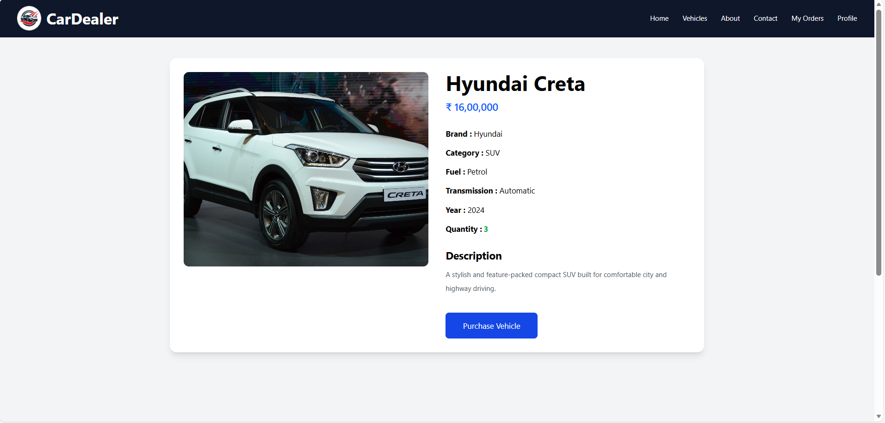

**Admin orders page**

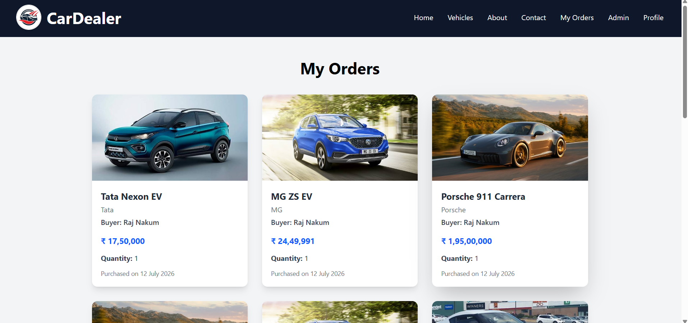

### Additional screenshots

**Signup page**

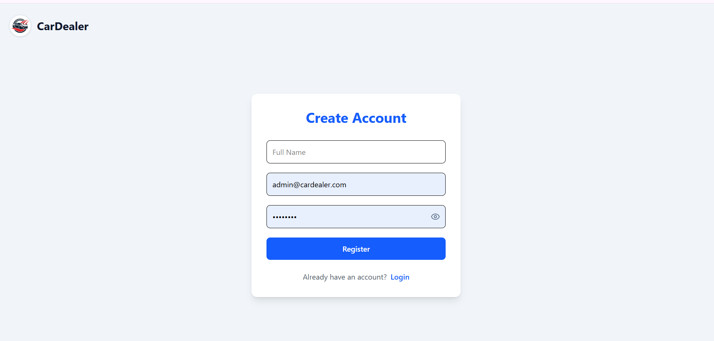

**Login page**

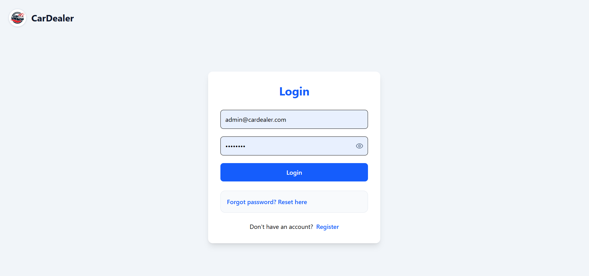

**Admin dashboard**

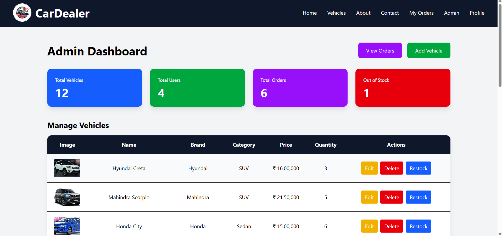

**Add vehicles page**

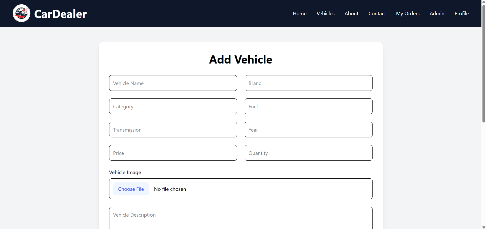

**Vehicle edit page**

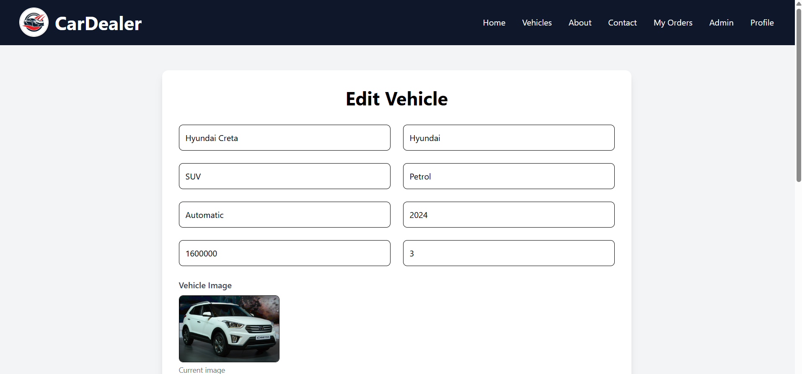

**Add vehicles page**


**Restock vehicles page**

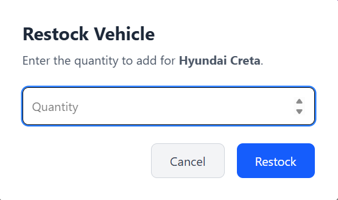

**Vehicles section**

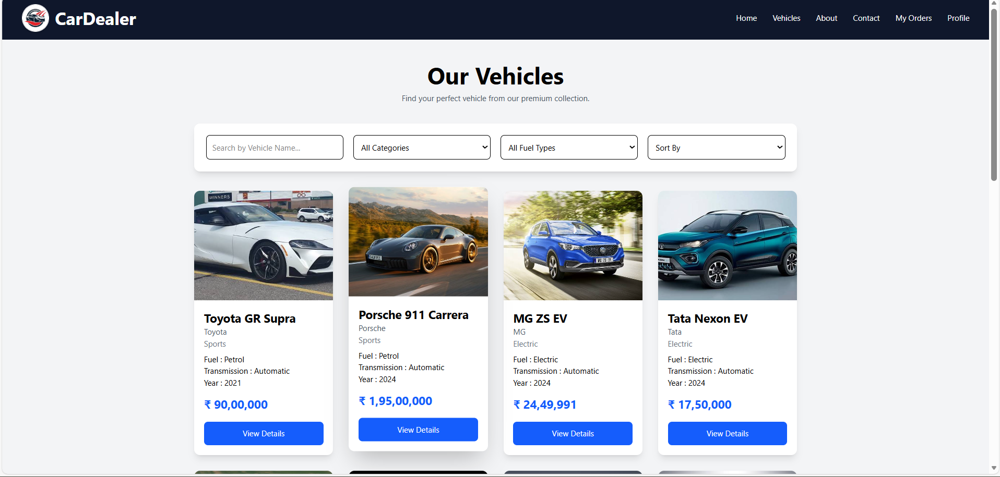

**Reset password page**

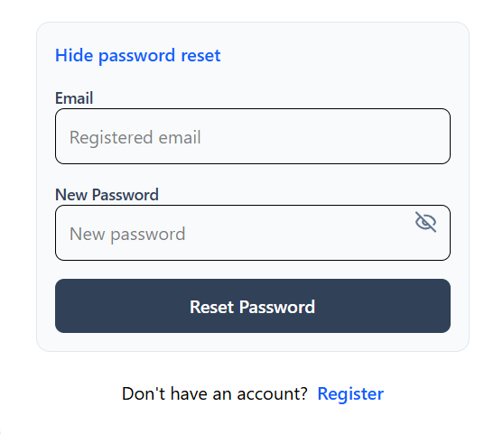

**Profile section**

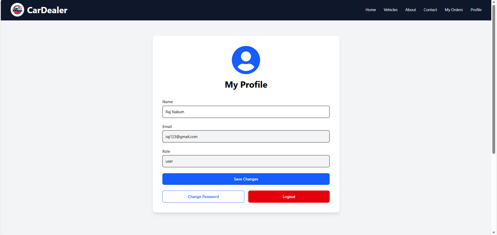

**My orders (user)**

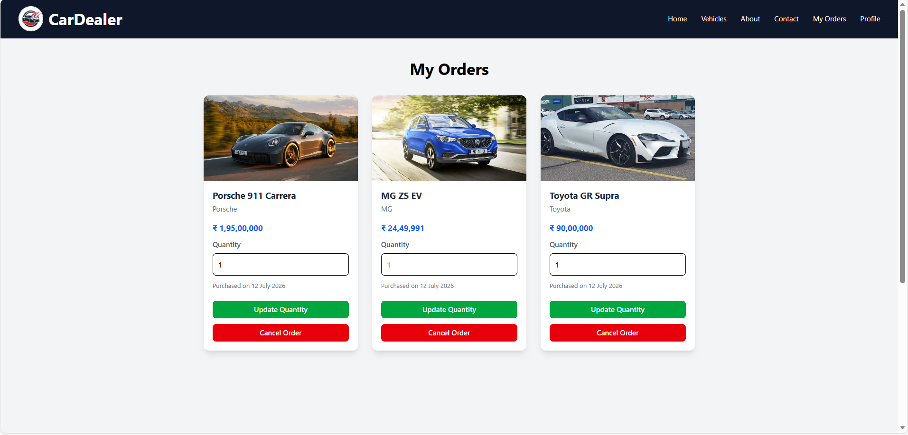

**Contact us page**

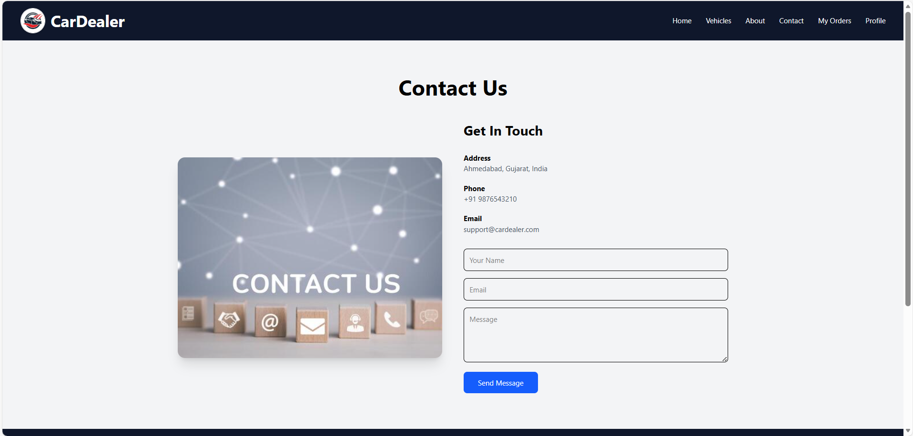

**About us page**

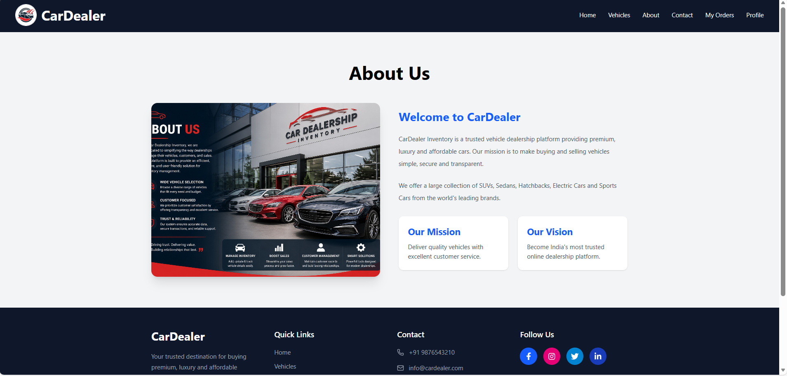


---

## My AI Usage

This README and other recent code changes were assisted by an AI coding assistant. The AI helped with the following tasks during development of this repository:

- Fixing a duplicate test-created user and moving tests to an isolated in-memory MongoDB to avoid production DB pollution.
- Implementing and wiring password reset endpoints and frontend UI.
- Auto-login after registration and redirect flow in the frontend.
- Adding a password visibility toggle to login/register forms.
- Preventing admin users from creating purchases (server-side 403 and UI disable).
- Adding endpoints and frontend flows for editing and cancelling customer orders.
- Patching multiple files across backend and frontend for the above features.


---


Thank you!
